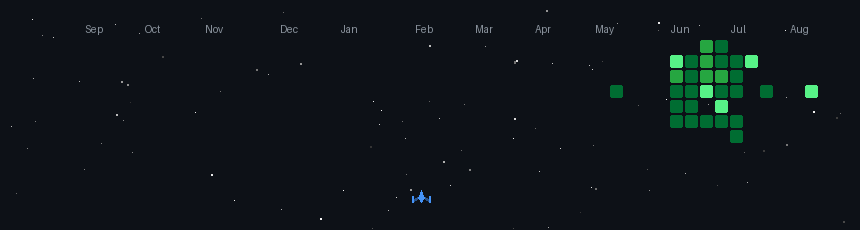

# Hi there! I'm Alay Sakhiya 

Welcome to my profile repository! I am a full-stack engineer passionate about building visually stunning, high-performance web applications and solving complex engineering challenges.

---

## 🚀 Space Shooter Game

This contribution game is automatically updated daily by GitHub Actions using my contribution history.

  

---

## 🛠️ Tech Stack & Tooling

  

---

## 📈 GitHub Stats

  
  

---

## 📬 Connect with Me

- 💼 **LinkedIn**: [linkedin.com/in/alaysakhiya](https://linkedin.com/in/alaysakhiya)
- 🌐 **Portfolio**: [alaysakhiya.dev](https://alaysakhiya.dev)
- ✉️ **Email**: alay.sakhiya@example.com
